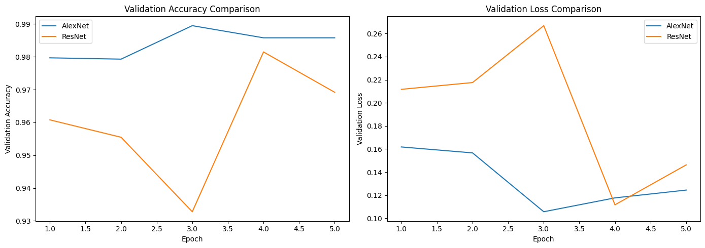

# Convolutional Neural Networks (CNN/ConvNets)

Convolutional Neural Networks (CNNs or ConvNets) are a class of neural networks that have proven highly effective for image processing and analysis tasks.

---

## Key Characteristics

- **Made up of neurons** with learnable weights and biases.
- Each neuron performs a **dot product** on its inputs, followed by a non-linearity.
- The network expresses a **single differentiable score function** from raw image input to output class scores.
- Utilizes a **loss function** (e.g., SVM or Softmax) at the final layer; all standard tricks for regular NNs apply.
- *Explicit assumption*: **Inputs are images**, allowing efficient architecture and fewer parameters.
- **Layers** are arranged in 3D: width, height, and depth.
- By the end of a CNN, the input is reduced to a vector of class scores.

---

## Layers in ConvNets

Each layer transforms a 3D input volume to a 3D output volume via a (often differentiable) function.

**Main Layers:**
- **Convolutional Layer**
- **Pooling Layer**
- **Fully-Connected Layer**
  - *CONV/FC layers*: Learnable parameters (weights, biases)
  - *RELU/POOL layers*: Fixed functions

**Training**: Parameters in CONV/FC are learned by gradient descent to ensure the output matches the training labels.

---

## Convolutional Layer

- **Parameters**: Set of small, learnable filters (spatially small but extend through full depth)
  - Example: 5x5x3 filter (for images with 3 color channels)
- Each output neuron connects to a **local region (receptive field/hyperparameter)** in the input volume.
- **Depth**: Number of filters (hyperparameter). Each filter learns to extract a different feature.
- **Stride**: How far to slide the filter (1 = one pixel at a time).
- **Zero-padding**: Padding inputs to control output size.
- **Output Volume**: Size formula

  \[
  \text{Output} = \frac{W - F + 2P}{S} + 1
  \]
  Where:  
  - \( W \): Input size
  - \( F \): Filter size
  - \( P \): Zero-padding
  - \( S \): Stride

- **Parameter Sharing**: All neurons in a depth slice share the same weights.
- **Convolution**: Actual operation is a convolution (dot product) over the local region.

Example:
- Input volume: [16x16x20], filter: 3x3, Output connections/neuron: 3x3x20 = 180.

---

**Real-World Example:**  
Krizhevsky et al. (2012) ImageNet winner:  
- Input: [227x227x3]
- First Conv Layer: 11x11 receptive field, stride 4, no padding
- Output Volume: [55x55x96]

---

### Advanced Conv Layer Concepts

- **1x1 convolution**: Useful for dimensionality reduction and mixing channel information.
- **Dilated Convolutions**: Introduce gaps in the filter; helps merge spatial info aggressively with fewer layers.

---

## Pooling Layer

- **Purpose**: Reduce spatial size, parameter count, computation, and overfitting.
- **Operation**: Applies independently to each depth slice using max/average/L2 pooling.
- **Common Configuration**: 2x2 filters with stride 2 (MAX), discarding 75% of activations.
- **Output size**:

  \[
  W_2 = \frac{W_1 - F}{S} + 1
  \]
  - Often,
    - F = 2, S = 2
    - F = 3, S = 2 (overlapping pooling)

- **No learnable parameters**; just fixed function.
- **Variations**:
  - *Max pooling* (most common)
  - *Average pooling* (less common recently)

- **Discussion**: Some researchers suggest discarding pooling layers and achieving downsampling with strided convolutions instead.

---

## Fully Connected (FC) Layer

- **Connections**: Each neuron is connected to all activations in the previous layer.
- **Operation**: Matrix multiplication + bias.
- **Equivalence**: Functionally similar to CONV layers, except for connection patterns and parameter sharing.

---

## Typical CNN Architecture Patterns

Architecture can often be described as:

INPUT → [[CONV → RELU] * N → POOL?] * M → [FC → RELU] * K → FC

Where \(*\) means repetition.

**Examples:**
- INPUT → FC (linear classifier)
- INPUT → CONV → RELU → FC
- INPUT → [CONV → RELU → POOL] * 2 → FC → RELU → FC
- INPUT → [CONV → RELU → CONV → RELU → POOL] * 3 → [FC → RELU] * 2 → FC

---

## Modern Architectures

- **LeNet**: Recognizing digits/zipcodes
- **AlexNet**: Early deep ConvNet in computer vision; 11x11 filters, stride 4
- **ZF Net**: Improved AlexNet with different filter/stride configurations
- **GoogLeNet (Inception Module)**: Fewer parameters (Inception v1: 4M vs AlexNet: 60M), uses Average Pooling instead of FC at top, several follow-up versions
- **VGGNet**: Very deep (16 layers), very homogenous (3x3 conv, 2x2 pool), high parameter count (140M), stride 1/pad 1, 2x2 max pooling, stride 2
- **ResNet**: Introduced skip connections, batch normalization, omits FC layers at the end, state-of-the-art as of 2016

---

## Layer Sizing Patterns

- **Input size**: Prefer dimensions divisible by 2 (e.g., 32, 64, 224, 384, 512)
- **Conv layers**: Prefer small filters (3x3, 5x5) with stride 1, zero-padding to preserve spatial size
- **First Conv layer**: May use larger filters (e.g., 7x7)
- **Pooling layers**: Downsample only at explicit points, not every conv layer
- **Memory consideration**: Small filter sizes may result in large activation volumes and high memory use

---

## Other Notes

- **Normalization Layers**: Sometimes used; their impact has been minimal in practice.
- **Converting between FC/CONV layers**: Possible as both can be seen as special cases of linear transformations with or without parameter sharing.
- **Recent Departures**: Inception and ResNet architectures challenge the strictly sequential layer paradigm with advanced connectivity.

---
**Validation results on the MNIST dataset show that AlexNet consistently achieves higher validation accuracy and lower validation loss compared to ResNet over 5 epochs.**

**Source:**  
[CS231n: Convolutional Neural Networks for Visual Recognition](https://cs231n.github.io/convolutional-networks/)
