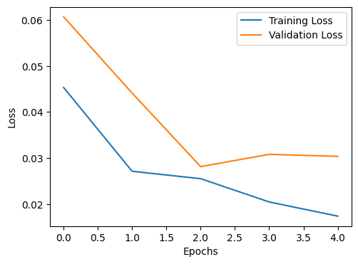

# EfficientNet Training Report

## Model: EfficientNet B0

### Training Settings

- **Dataset:** *MNIST*
- **Epochs:** 5
- **Optimizer:** Adam
- **Loss Function:** Categorical Crossentropy
- **Metrics:** Accuracy, Loss (Train/Validation)

---

### Training Log (Epoch-wise)

---

### Train-Val Set Results

---

### Notes

- Model achieves high accuracy and low loss on both validation and test sets, with no signs of overfitting.

---

