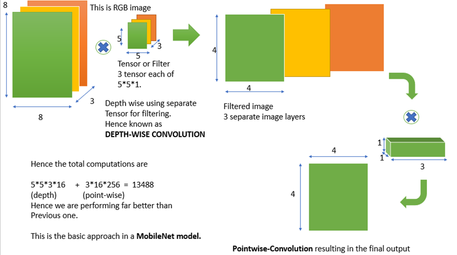
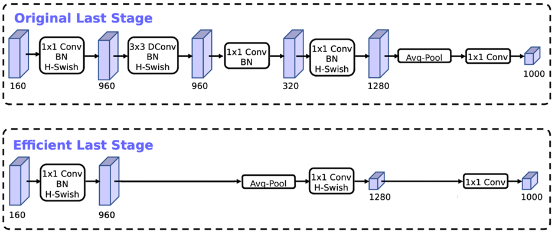

# MobileNet

## Key Idea
- Utilizes **depthwise separable convolutions** and **pointwise convolutions**, which differ from normal convolutions in standard CNNs.
- Enables high efficiency for image recognition, allowing deployment in mobile and embedded systems with limited computational resources.
- Reduces computational time for classification and recognition, delivering fast, responsive models suitable for real-time applications.

## Architecture Overview
- **Input Layer:** Standard convolution (commonly 32 filters, stride 2).
- **Stack of Blocks:** Multiple inverted residual blocks using depthwise separable convolutions, which expand/compress data and optimize computational cost.
- **Pooling & Output:** Final 1×1 convolution, global average pooling, and a fully connected layer (softmax) for classification.

## Innovations and Improvements
- Designed to work efficiently on devices without dedicated GPUs (phones, IoT, Raspberry Pi, etc.).
- Inverted residuals and linear bottlenecks improve both speed and accuracy—key for mobile deployment.
- Reduces parameters and memory usage compared to traditional deep CNNs.

## Best Use-Cases & Applications
- **Mobile/Embedded Devices:** Ideal for smartphones, drones, and edge systems.
- **Real-time Object Detection:** Used in AR/VR, robotics, and surveillance—where speed is critical.
- **Medical Imaging:** Enables classification (X-rays, skin lesions, retinas) on edge devices.
- **Smart Cameras:** Vision in smart home devices, doorbells, and security.
- **Retail/Inventory:** Visual product search, shelf monitoring without barcodes.
- **Autonomous Vehicles:** Reliable object and sign recognition with low compute.

## Strengths
- **Lightweight and Fast:** Supports real-time inference on devices lacking GPUs.
- **Pretrained Models Available:** ImageNet weights streamline transfer learning.
- **Versatile Deployment:** Mobile apps, web browsers, and resource-constrained edge devices.

## Weaknesses/Caveats
- **Lower Accuracy:** Performance can lag deeper models (ResNet, EfficientNet) on complex tasks.
- **Limited Feature Extraction:** Struggles with fine-grained, high-res classification.
- **Preprocessing Sensitivity:** Requires strict input size/scaling for reliability.

## Personal Notes/Reflections
- MobileNetV2 is a cool, lightweight CNN for mobile platforms—low memory consumption and high efficiency.
- Primary efficiency comes from using depthwise separable convolutions over traditional convolutions.

## Resource Links
- [Blog on MobileNet](https://www.geeksforgeeks.org/machine-learning/image-recognition-with-mobilenet/)
