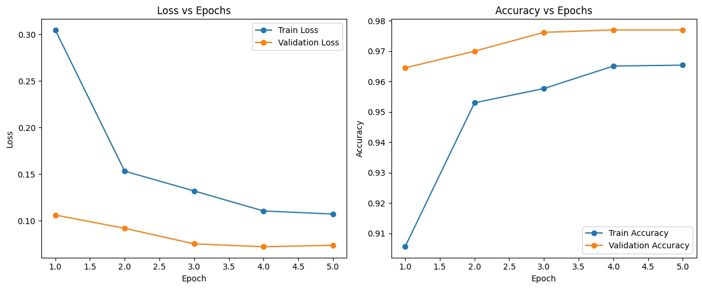

# MobileNetV2 Training Report

## Model: MobileNetV2

### Training Settings

- **Dataset:** *MNIST*
- **Epochs:** 5
- **Optimizer:** Adam
- **Loss Function:** Categorical Crossentropy
- **Metrics:** Accuracy, Loss (Train/Validation)

---

### Training Log (Epoch-wise)

---

### Test Set Results

- **Test Loss:** 0.0912
- **Test Accuracy:** 0.9703

---

### Notes

- Metrics were manually extracted from output logs, as the `History` object wasn’t assigned at fit.
- Model achieves high accuracy and low loss on both validation and test sets, with no signs of overfitting.

---

