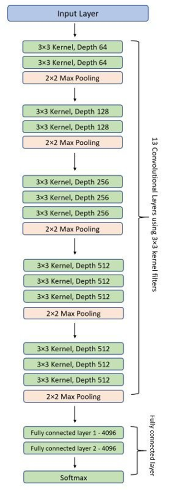
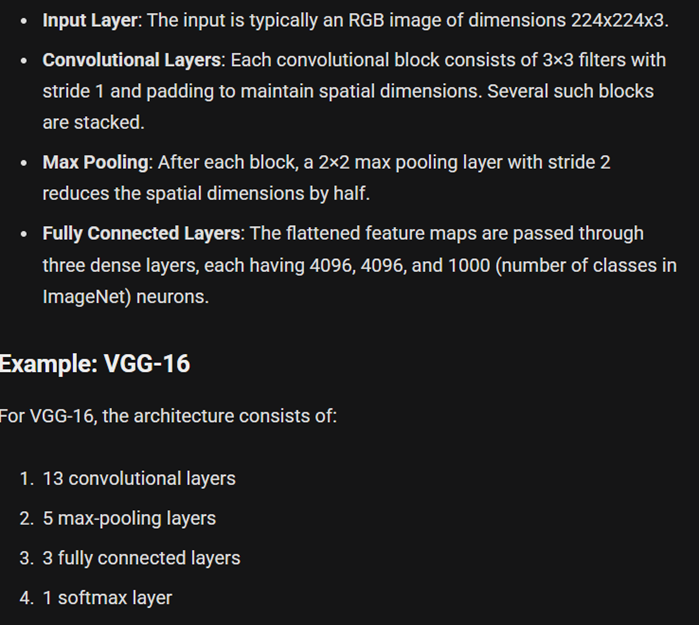
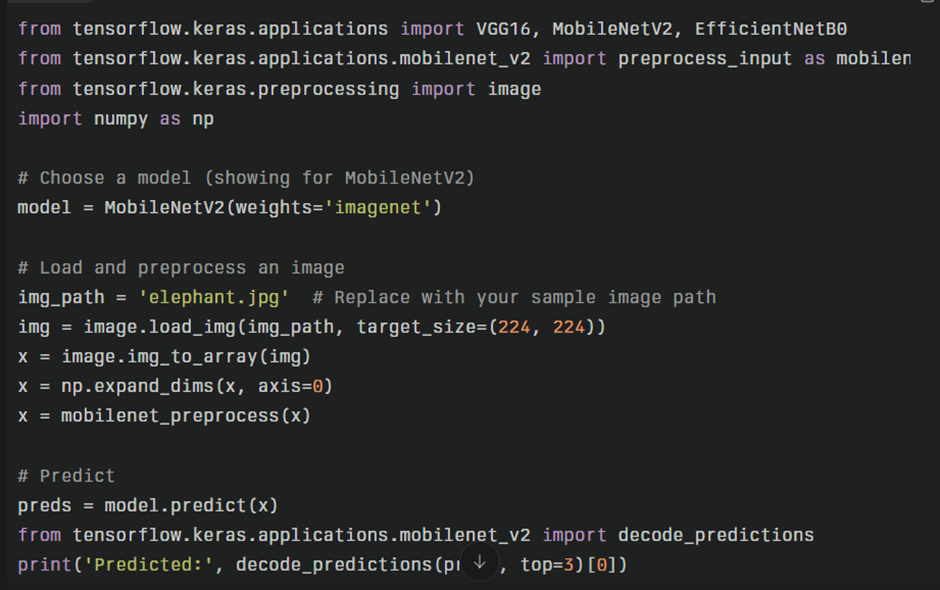

# VGG Model

## Key Idea
- Depth and simplicity in network design deliver remarkable performance.
- VGG uses small convolutional filters, dramatically increasing network depth to extract intricate features.
- Approximately 138 million parameters enable deep stacking and learned weights.

## Architecture Overview
- Sequential stacking of 3×3 convolutional layers, interleaved with ReLU activation and 2×2 max pooling.
- Ends with three fully connected layers and a softmax for classification.

## Innovations/Improvements
- Standardizes small convolutions versus AlexNet’s varied, larger filters.
- Simplified design made analysis and implementation easier.
- Depth pioneered “deep” learning and inspired models such as ResNet and DenseNet.
- High performance on ImageNet set a new benchmark; serves as a baseline for new architectures.
- Modern models (ResNet, EfficientNet, etc.) surpass VGG in efficiency, but VGG’s influence is foundational.
- Taught the importance of depth, simplicity, modularity to the field.

## Best Use-Cases/Applications
- State-of-the-art performance on image recognition tasks with deep but simple design.
- Pre-trained weights facilitate fast transfer learning in fields like medical imaging and autonomous driving.
- Adapted as a backbone for object detection models (e.g., R-CNN).
- Widely used for feature extraction in style transfer and image segmentation.

## Strengths
- Simple modular design: uniform 3×3 convolutions allow easy adaptation.
- Deep network: versions VGG-11, VGG-16, and VGG-19, with layer count corresponding to depth.
- Uniform convolution and pooling: regular feature extraction and computational efficiency.
- Dense fully connected layers for effective decision making at output.

## Weaknesses/Caveats
- Large parameter count (138+ million) and depth require high-end GPUs and significant memory.
- Not suitable for resource-constrained environments due to memory and computational costs.
- Prone to overfitting if not regularized, especially with limited data.

## Sample Code Link or Snippet

## Resource Links
- [How it revolutionized deep neural networks](https://arunangshudas.com/blog/how-it-revolutionized-deep-neural-networks/)

## Personal Notes/Reflections
- VGG was easy to understand after AlexNet’s big filters and shallow depth.
- VGG’s uniform 3×3 filters and increased layers did all the work.
- Needs more GPU and memory than simpler architectures.
