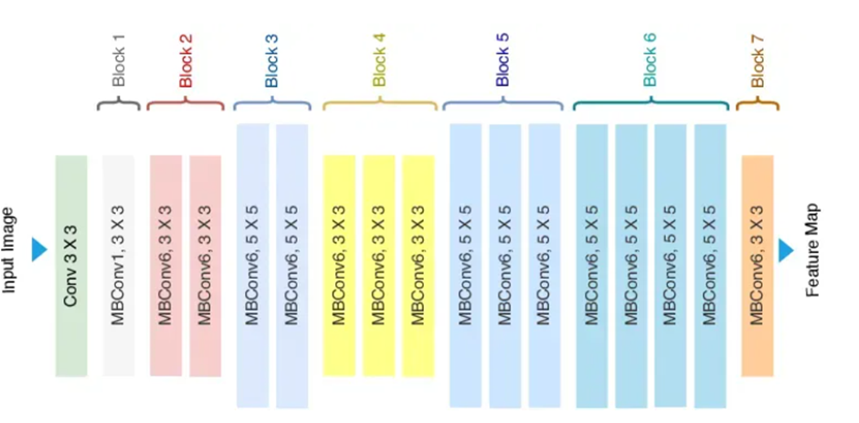

# EfficientNet

## Key Idea
- Balances **computational efficiency** and **model performance** using a novel scaling strategy.
- Introduces **compound scaling** to address the trade-off between accuracy and resource allocation by jointly scaling width, depth, and resolution.
- Efficiently adjusts model dimensions, striking an optimal balance for varying computational budgets and hardware capabilities.

## Compound Scaling: Three Dimensions
- **Width:** Number of channels in each layer. Wider networks capture more patterns and features (↑accuracy), but may increase resource usage; narrower = lightweight.
- **Depth:** Number of layers. More layers = richer representation (↑accuracy), but demand more resources; shallower = speed/efficiency.
- **Resolution:** Input image size. Higher resolution = more detailed features, better performance; lower = less resource consumption.
- EfficientNet grid-searches the optimal combination, guided by a **compound coefficient φ** that uniformly scales all dimensions.
  - **Width:** scaled by \( φ^\alpha \)
  - **Depth:** scaled by \( φ^\beta \)
  - **Resolution:** scaled by \( φ^\gamma \)
  - Constants **α**, **β**, **γ** are empirically chosen for balanced scaling.

## Architecture Overview
- Uses **Mobile Inverted Bottleneck (MBConv) layers**—combine depth-wise separable convolutions and inverted residual blocks for efficient feature extraction.
- **Squeeze-and-Excitation (SE) block:** Recalibrates channel-wise feature responses, enhancing accuracy and efficiency.
- Sequential stacking: MBConv (depth-wise convolution → point-wise convolution to expand channels → point-wise convolution to restore original size).
- SE block uses global average pooling, followed by fully connected layers to focus attention on relevant features.
- EfficientNet has multiple variants (B0, B1, ...), each representing a different φ value and corresponding to a specific resource/accuracy trade-off.

## Best Use-Cases & Applications
- Object recognition
- Image segmentation
- Language processing
- Deployable on edge devices, large-scale systems, and any application demanding accuracy with efficiency.

## Strengths
- Matches or surpasses state-of-the-art models with a fraction of parameters and FLOPs.
- **Balanced scaling**: Compound scaling ensures optimal resource utilization for robust performance.
- Smaller sizes—suitable for real-world inference and large-scale deployments.
- **Sustainable**: Lower energy consumption makes EfficientNet practical environmentally and economically.

## Caveats
- **Deployment complexity**: Larger variants (e.g., B5–B7, V2‑L) may introduce latency/resource constraints in real-time systems.
- **Scaling in production**: Larger models need careful planning to avoid bottlenecks.
- **Fine-tuning sensitivity**: May require extensive hyperparameter optimization for best results.
- **Less intuitive**: Compound scaling can be harder to grasp than legacy architectures like ResNet.

## Resource Links
- [Roboflow: What is EfficientNet?](https://blog.roboflow.com/what-is-efficientnet/)

## Personal Notes/Reflections
- EfficientNet is straightforward conceptually—it’s all about scaling smartly.

