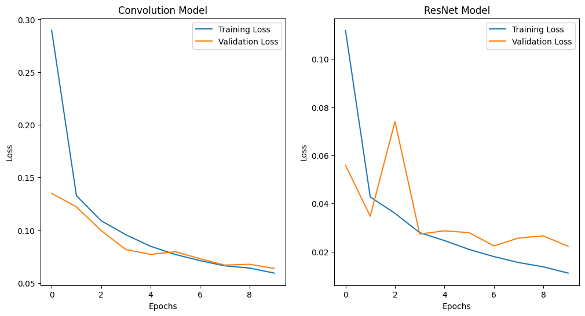
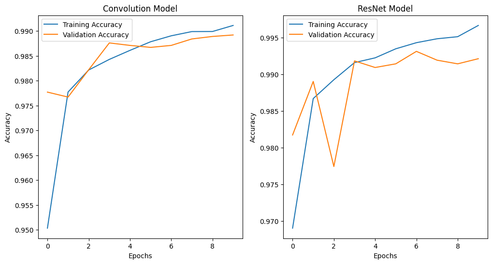
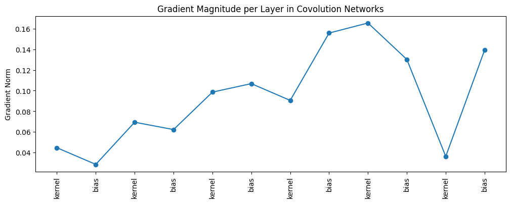
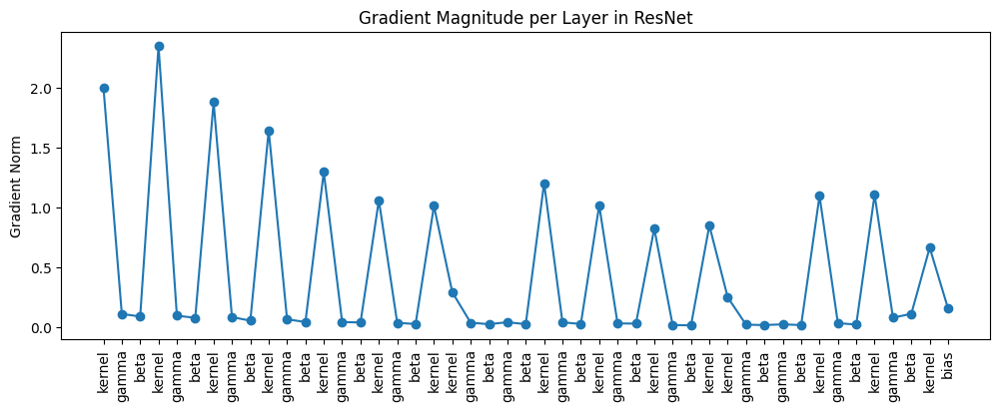
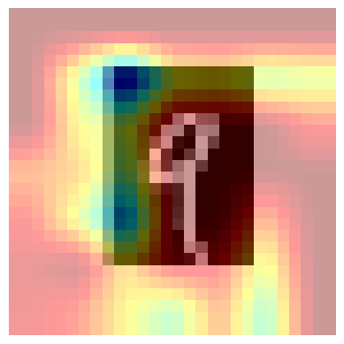

Deep Learning Model Comparison Report: CNN vs. ResNet
This document presents a comparative analysis of two neural network architectures—a standard Convolutional Model and a Residual Network (ResNet)—based on their training dynamics and gradient behavior.

Training Performance: Loss and Accuracy
The following charts illustrate the models' performance over 10 training epochs.

1. Loss Comparison
Convolution Model (Left): Shows a smooth, continuous decrease in both training and validation loss, indicating stable learning.

ResNet Model (Right): Shows a much lower absolute loss, suggesting better optimization. However, the validation loss exhibits more volatility (spikes), which is common in very deep networks and may be due to the nature of the residual connections or learning rate schedule.

2. Accuracy Comparison
Both Models: Achieve very high accuracy (above 0.98 for validation and approaching 0.99 for training) and appear to be converging.

ResNet Advantage: The ResNet model generally achieves a higher validation accuracy and shows steeper initial learning, confirming its ability to effectively train deep architectures.

Gradient Dynamics: The Vanishing/Exploding Gradient Problem
These visualizations compare the Gradient Norm (magnitude) across the layers' trainable parameters (kernel, bias, gamma, beta), which is a key metric for understanding the stability of the backpropagation process.

3. Gradient Magnitude in the Convolutional Network
Observation: The gradient magnitudes remain relatively small (mostly below 0.16) and are somewhat evenly distributed across the layers' kernel and bias parameters.

Interpretation: This behavior is typical of networks that are not excessively deep or those that utilize techniques like Batch Normalization. The smaller, more stable gradients indicate a reduced risk of the exploding gradient problem.

4. Gradient Magnitude in the ResNet Model
Observation: The gradient magnitudes are significantly larger than in the CNN, with peaks exceeding 2.0. The gradients also display extreme volatility, often dropping to near-zero for gamma and beta parameters and spiking for kernel parameters.

Interpretation: The large spikes indicate that even with residual connections, the deep ResNet architecture can experience exploding gradients in specific layers. The zero/near-zero gradients for the Batch Norm parameters (gamma, beta) could suggest these layers are stabilizing or have converged very quickly.

Feature Visualization
5. Activation Heatmap (Prediction Visualization)
Description: This image likely represents a visualization technique (such as Grad-CAM or similar saliency map) applied to one of the models for a single prediction. It shows the digit '4' or '9' centered on a heat-mapped background.

Interpretation: The visualization highlights the areas of the input image that the network focused on when making its prediction, showing that the model's highest activations (blue/dark red) are strongly correlated with the object's core features.
