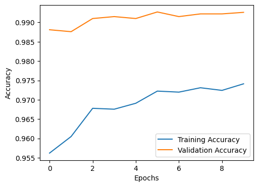
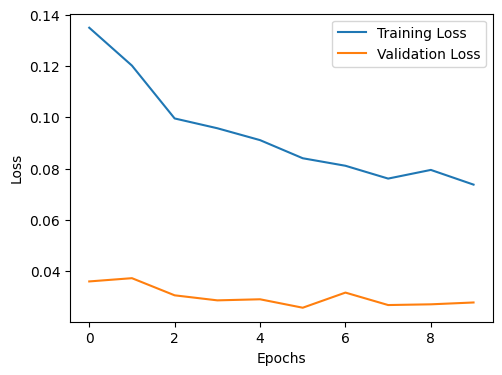

# MNIST Classification with VGGNet16

- **Model Architecture:** VGGNet16
- **Dataset:** MNIST (Handwritten Digits)
- **Validation Performance:**
  - **Validation Accuracy:** 0.9926 (99.26%)
  - **Validation Loss:** 0.0278
- **Epochs:** 10

## Key Observations
- The model achieved **extremely high accuracy**, indicating excellent ability to recognize handwritten digits in the MNIST dataset.
- **Low validation loss** further confirms strong model generalization and low overfitting.
- VGGNet16’s deep, uniform 3×3 convolutions can effectively capture MNIST’s spatial patterns even though MNIST images are simple and small.
- But it had very high compilation time ~50 minutes.

## Result Screenshot

## Reflections
- VGGNet16 is often considered excessive for MNIST due to its large parameter count, but its depth enables it to nearly maximize classification accuracy on this simple dataset.
- For larger or more complex datasets, careful regularization and computational considerations may be needed, but for MNIST, this result demonstrates both the power and flexibility of deep CNNs like VGGNet16.
