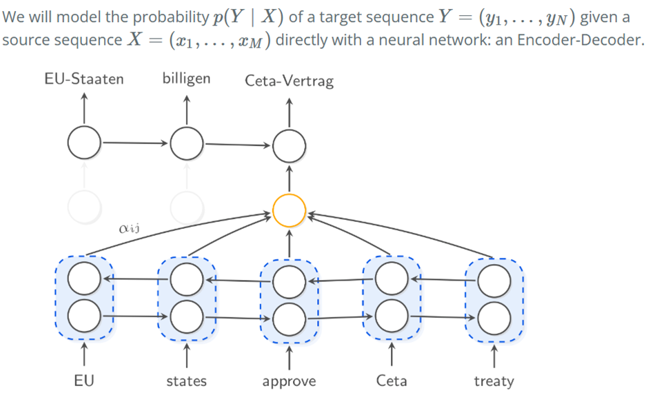
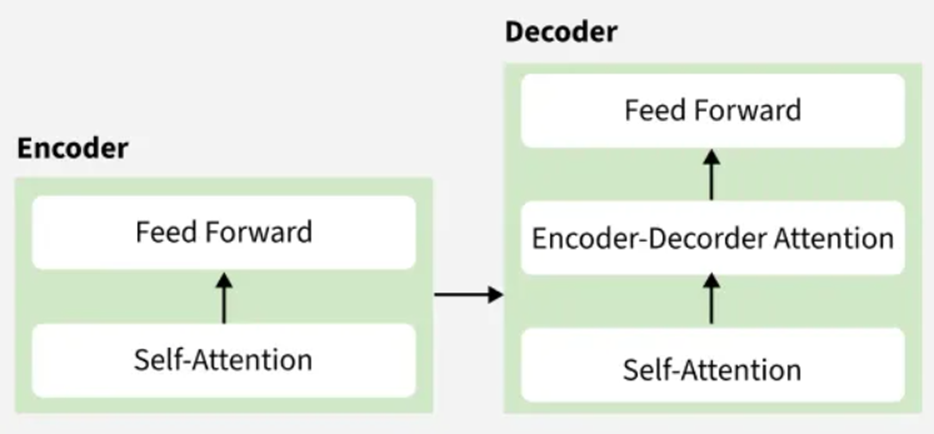

# Encoder–Decoder Architecture Notes

## Overview
In deep learning, the **encoder–decoder model** is a type of neural network mainly used for tasks where both the input and output are sequences. This architecture is effective when the input and output sequences are of different lengths.  

**Common applications include:**
- Machine Translation (e.g., English → French)  
- Text Summarization  
- Image Captioning  
- Speech-to-Text conversion  

In an encoder–decoder model, the **encoder** and **decoder** are two separate networks, each with a specific task. These networks can use different architectures such as:  
- [Recurrent Neural Networks (RNNs)](https://www.geeksforgeeks.org/machine-learning/introduction-to-recurrent-neural-network/)  
- [Long Short-Term Memory (LSTM)](https://www.geeksforgeeks.org/deep-learning/deep-learning-introduction-to-long-short-term-memory/)  
- [Gated Recurrent Units (GRUs)](https://www.geeksforgeeks.org/machine-learning/gated-recurrent-unit-networks/)  
- [Convolutional Neural Networks (CNNs)](https://www.geeksforgeeks.org/machine-learning/introduction-convolution-neural-network/)  
- [Transformers](https://www.geeksforgeeks.org/physics/transformer/)  

---

## Key Components

### Encoder
- **Encoder**: Processes the input sequence step by step and creates a *context vector* (latent representation).  
- **Self-Attention Layer**: Helps the encoder focus on important parts of the input and model dependencies between tokens.  
- **Feed-Forward Neural Network**: Captures higher-level patterns and refines the representation.  
- **Output**: Produces a fixed-size *context vector* summarizing the entire input.  

### Decoder
- **Decoder**: Takes the *context vector* and generates the target sequence step by step.  
- **Self-Attention Layer**: Lets the decoder attend to previously generated tokens while creating new ones.  
- **Encoder–Decoder Attention Layer**: Lets the decoder attend to relevant input information from the encoder.  
- **Feed-Forward Neural Network**: Processes attended information and generates the final output tokens.  

---

## Training Details

1. **Tokenization**: The input sequence is tokenized into words or subwords.  
2. **Embedding**: Each token is converted into a vector representation.  
3. **Encoding**: Embedded tokens pass through the encoder, where:
   - Self-attention layers capture important relations between tokens.  
   - The final representation is a *context vector*.  
4. **Context Vector**: Acts as a summary of the input sequence.  
5. **Decoding**:  
   - The decoder receives the context vector.  
   - It starts generating the output *one token at a time*.  
   - Each new token is predicted based on context and previously generated tokens.  
   - Encoder–decoder attention ensures the decoder "looks back" at input tokens when needed.  
6. **Sequence Generation**: Tokens are produced sequentially until the full output sentence is generated.  

---

## Workflow Summary  
Input Sequence → **Encoder** → Context Vector → **Decoder** → Output Sequence  
