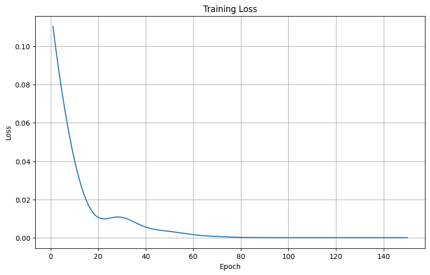

# GRU Model for Google Stock Price Prediction

## Overview

This project demonstrates the use of a Gated Recurrent Unit (GRU) neural network for predicting the closing prices of Google stock based on a variety of historical features. The model outperformed LSTM on this dataset, achieving an RMSE of **13.61** after 150 epochs with a single hidden GRU layer of 128 units and a sequence length of 20.

---

## Dataset and Features

- **Source:** Google stock market historical data
- **Features Used:**
  - `open`
  - `high`
  - `low`
  - `adjClose`
  - `adjHigh`
  - `volume`
  - `adjOpen`
  - `adjVolume`
- **Target:**  
  - `close` (next closing price prediction)
- **Sequence Length:** 20 (model uses previous 20 days for prediction)

---

- **Final RMSE after 150 epochs:** `13.61`

---

## Insights

- Using GRU instead of LSTM reduced error and computational overhead, while maintaining accuracy for stock time series.
- Larger hidden dimension (128 units) and longer training (150 epochs) improved results.
- Sliding window sequences of length 20 provide sufficient context for financial time series prediction.

---

## References

- PyTorch GRU documentation [web:125]
- Stock market forecasting with GRU [web:130][web:132]

