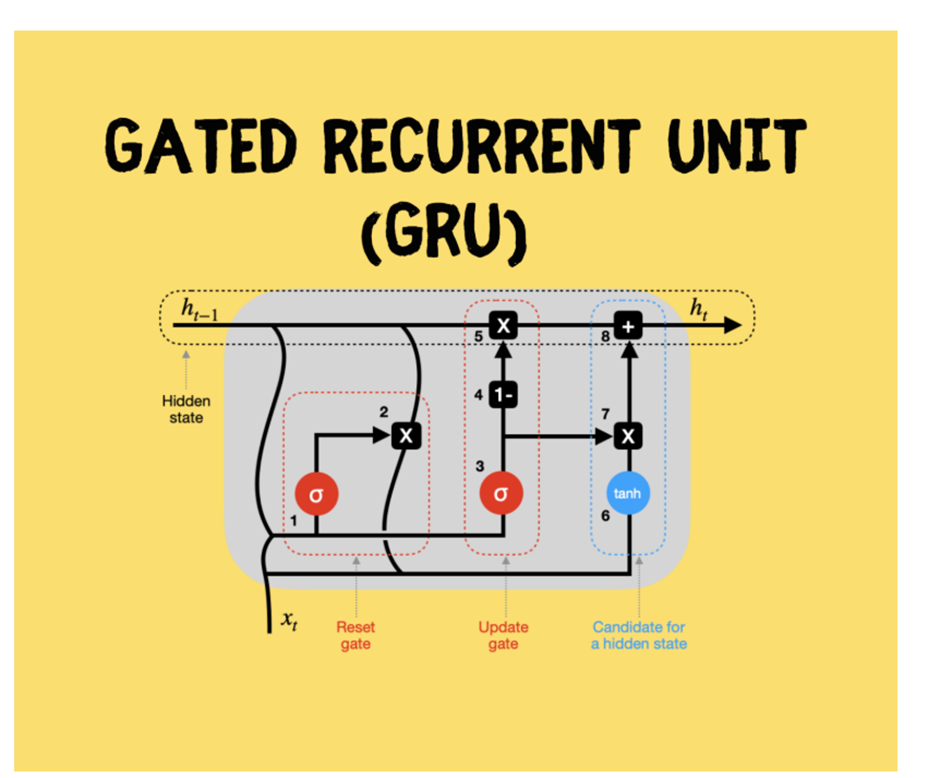
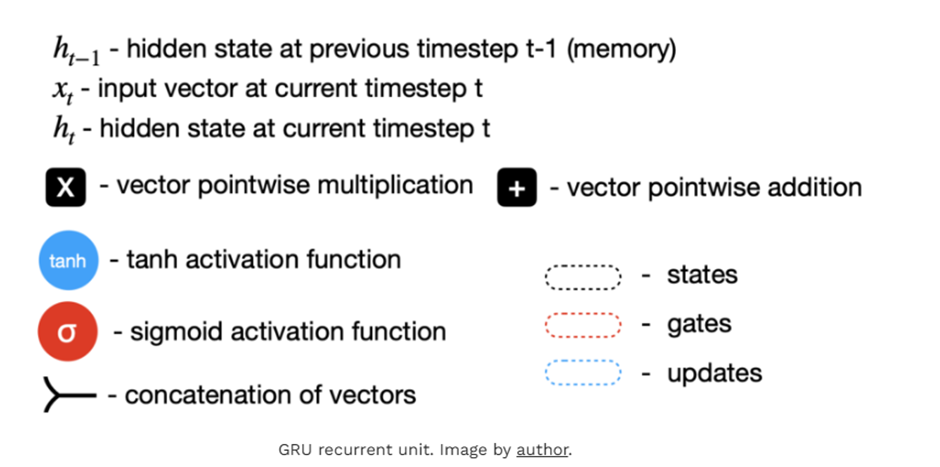

# GRU - Gated Recurrent Units

## Intuitive Overview

- **GRU is similar to LSTM** in both architecture and predictive ability, effectively learning temporal sequence dependencies.
- Designed to model short-term and medium-term dependencies with streamlined gates and efficient memory transfer.

## Key Architecture Points

- GRU modules rely solely on a hidden state for memory transfer—there is **no separate cell state** like in LSTM.
- Two main gates control information flow:
  - **Reset Gate:** Combines past hidden state (`h_{t-1}`) and current input (`x_t`), using sigmoid activation to decide which values to discard, remember, or partially retain.
  - **Update Gate:** Analogous in function but uses independent weights and bias; the output guides which new information to add and how much previous hidden state to keep.
- **Hidden State Candidate:** Combines reset-modified hidden state and new inputs, passes them through tanh activation, and blends outcomes to update the new hidden state.
- The process iterates for every timestep, efficiently handling sequence data.

## When to Use GRU

- Real-time speech and voice recognition.
- Chatbots and conversational AI systems.
- Resource-constrained (mobile/embedded) deployments needing lower compute overhead.

## Strengths

- **Faster speed:** Fewer parameters and absence of cell state often mean GRUs train faster and converge quickly in practice[web:29][web:42].
- **Lower memory usage:** Light architecture, making GRUs ideal for limited-resource environments[web:35].
- **Computational efficiency:** Just two gates (update, reset) instead of LSTM’s three, reducing complexity[web:29][web:36].
- **Less prone to overfitting:** Simpler parameter space can help on smaller datasets[web:42].
- **Effective for most sequence tasks:** Speech recognition, time series forecasting, and NLP tasks[web:38][web:36].
- **Strong handling of vanishing gradients:** Gates help maintain stable gradients[web:29][web:41].

## Weaknesses / Challenges

- **Limited long-term memory:** GRUs may underperform LSTMs in long, deep sequence tasks due to the lack of a separate cell state[web:36].
- **Potential instability:** Certain complex tasks require careful hyperparameter tuning for stable training[web:41].
- **Subtle underperformance on deep models:** Deep architectures or document-level modeling sometimes favor LSTM for recall precision[web:38].
- **Regularization still needed:** Dropout or other techniques may still be necessary on noisy/small data[web:36].

## My Insights

- The computation—all performed with just update and reset gates—makes GRU lighter and computationally simpler than LSTM, without significant loss of sequence modeling power for most practical applications.

## Reference Links

- [GRU Recurrent Neural Networks - A Smart Way to Predict Sequences in Python (Towards Data Science)](https://towardsdatascience.com/gru-recurrent-neural-networks-a-smart-way-to-predict-sequences-in-python-80864e4fe9f6/)
