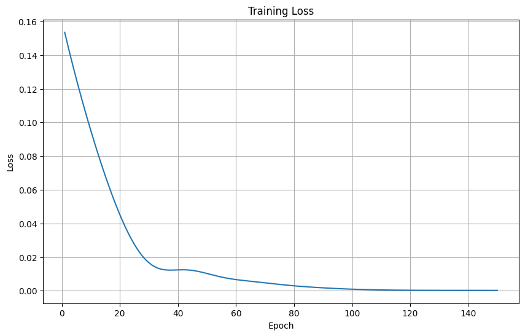

# LSTM Model for Google Stock Price Prediction

## Overview

This project implements a Long Short-Term Memory (LSTM) neural network to predict the closing price for Google stock using historical features. Under the same settings as the GRU model, the LSTM achieved an RMSE of **25.99** after 150 epochs, with one hidden LSTM layer of 128 units and a sequence length of 20.

---

## Dataset and Features

- **Source:** Google stock market historical data
- **Features Used:**
  - `open`
  - `high`
  - `low`
  - `adjClose`
  - `adjHigh`
  - `volume`
  - `adjOpen`
  - `adjVolume`
- **Target:**  
  - `close` (next closing price prediction)
- **Sequence Length:** 20 (previous 20 days)

- **Final RMSE after 150 epochs:** `25.99`

---

## Insights

- LSTM is particularly effective for learning long-term dependencies and time series trends, but in this experiment GRU achieved lower RMSE with the same architecture and training settings.
- Sequence window length and hidden dimension significantly impact performance.

---

## References

- PyTorch LSTM documentation [web:137][web:138]
- Stock price prediction with LSTM [web:137][web:141]

