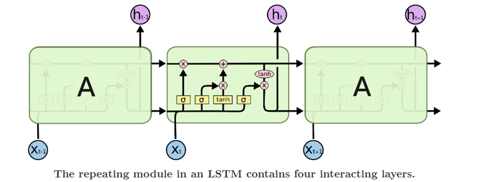
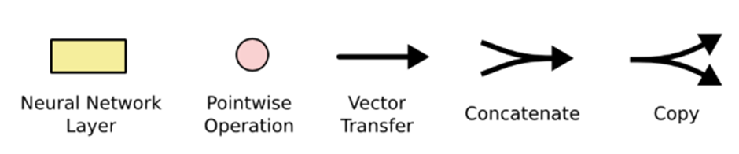
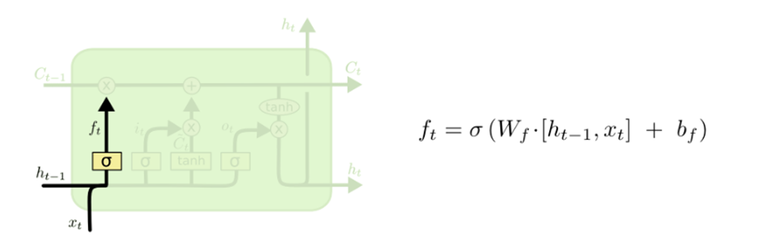
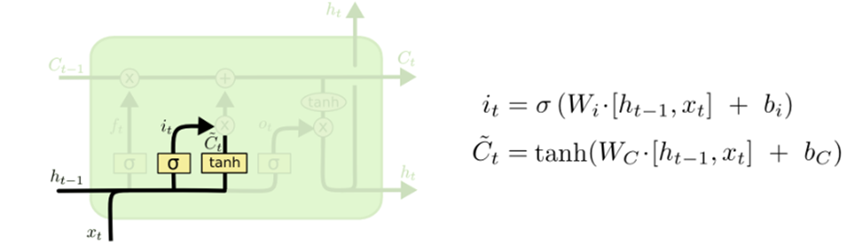
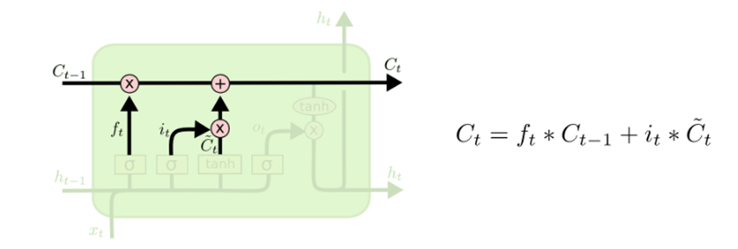
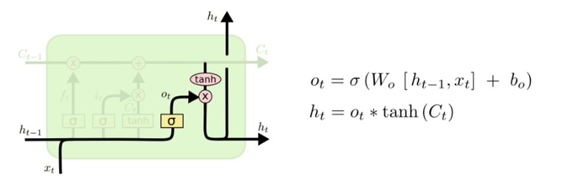

# LSTM - Long Short Term Memory

## Intuitive Overview

- **A special kind of RNN** capable of learning long-term dependencies, widely used for sequential data tasks.
- Remembering information for long periods of time is their default behavior, not something they struggle to do.

## Key Architecture Points

- Standard RNNs consist of a chain of repeating neural network modules, typically with a single tanh layer.
- **LSTMs** have a similar chain structure, but the repeating module is fundamentally different: it contains 4 interacting layers, not just one.

  - Each line in a diagram carries an entire vector from the output of one node to the inputs of others.
  - Pink circles denote pointwise operations (like addition); yellow boxes are learned neural layers.
  - Merging lines represent concatenation. Forking lines indicate copies going to multiple locations.
 
 
## Step-by-step LSTM Walkthrough

1. **Forget Gate**  

   Decides what information to discard from the cell state.  
   - Uses sigmoid activation on \( h_{t-1} \) and \( x_t \), producing values from 0 (forget) to 1 (keep).
2. **Input Gate + Candidate Values**  

   Decides what new information to store.  
   - Sigmoid input gate selects which values will update the state.  
   - Tanh layer creates new candidate values \( \tilde{C}_t \) for addition.
3. **Update Cell State**  

   - Combines steps above to update cell state:
   \[
   C_t = f_t \ast C_{t-1} + i_t \ast \tilde{C}_t
   \]
4. **Output Gate**  

   - Determines what part of the cell state to output.
   - Sigmoid activation filters cell state, which is sent through tanh before output.
   \[
   h_t = o_t \ast \tanh(C_t)
   \]

## LSTM Variants

- **Peephole connections:** Gates can access cell state directly for finer control.
- **Coupled Forget/Input Gates:** Forget and input updates happen together.
- **GRU:** A simplified LSTM variant (see below).

## When to Use LSTM

- Tasks with **long-term dependencies**: Where context from many steps ago matters.
- Complex sequential problems.
- Time series forecasting.
- Anything needing precise, persistent memory.

## Strengths

- **Long-term dependency learning:** Retains information over vast intervals.[web:17]
- **Mitigates vanishing gradient problem:** Stable learning for many steps.[web:21]
- **Selective memory retention:** Learns what to remember, update, or forget for dynamic focus.[web:17]
- **Flexible with variable sequence lengths:** Adapts naturally to translation, forecasting, generation.[web:17]
- **Parallel hardware support:** Efficient on GPUs for large models.[web:17]

## Weaknesses/Challenges

- **High computational cost:** Multi-gate structure makes them slow and memory intensive.[web:17][web:39]
- **Prone to overfitting:** Large capacity requires careful regularization.[web:17][web:39]
- **Lower interpretability:** Hard to trace decisions due to many gates and states.[web:39]
- **Training instability:** Still needs gradient clipping, careful initialization.[web:17]
- **Resource requirements:** Not ideal for real-time or embedded systems.[web:17][web:39]

## My Insights

- LSTM excels at remembering previous data.
- Data entry first triggers decision to keep or discard info (forget gate).
- Then determines which info to update (input gate + candidate).
- Updates old cell state to new one.
- Output is a filtered version, using sigmoid and tanh gating to select relevant info.

> Considering the shortcomings, alternative models such as GRU or Transformers address some of these efficiency and parallelism issues.

## Reference Links

- [Explainer by Christopher Olah](https://colah.github.io/posts/2015-08-Understanding-LSTMs/) [web:17][web:21]
