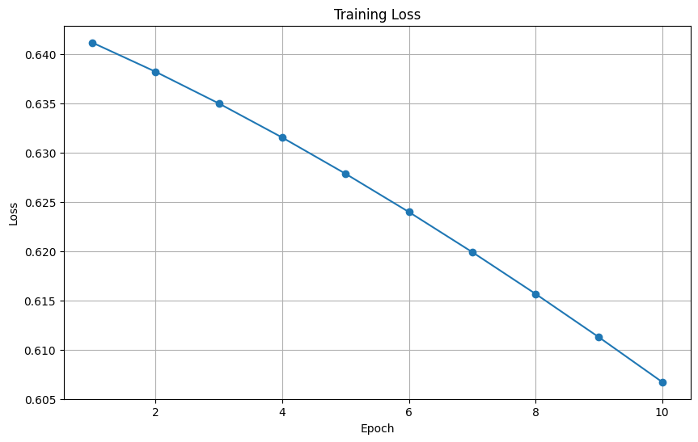

# Sample RNN Model in PyTorch

This project demonstrates training a simple Recurrent Neural Network (RNN) using PyTorch on synthetic sequence data and reports key evaluation metrics.

---

## 📦 Model Architecture

SimpleRNNModel(
(rnn): RNN(8, 32, batch_first=True)
(fc): Linear(in_features=32, out_features=2, bias=True)
)

- **RNN layer:**  Input size 8, hidden size 32, batch mode enabled (shape: `[batch, seq, features]`)
- **Fully Connected layer:**  Maps the last hidden state (32) to 2 output classes

---

## 📈 Loss Curve

---

## 🧮 Evaluation Metrics

After 10 epochs, the test set results were:

| Metric      | Value   |
|-------------|---------|
| **Loss**        | 0.6067  |
| **Accuracy**    | 0.8000  |
| **Precision**   | 0.7937  |
| **Recall**      | 0.8000  |
| **F1-score**    | 0.7867  |

---

## 📝 Notes

- The model was trained for 10 epochs on fully synthetic data.
- Train/test split: **80/20**
- Results confirm the model can learn distinct features from small sequence data even with a basic RNN.

---

