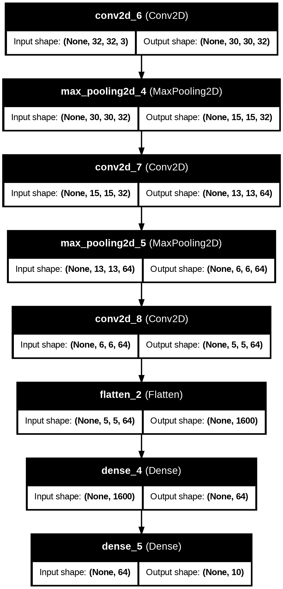
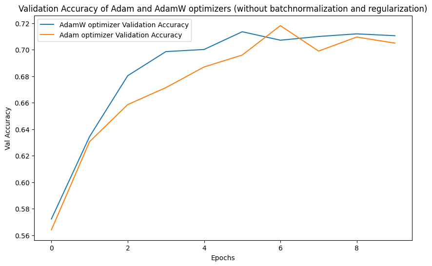
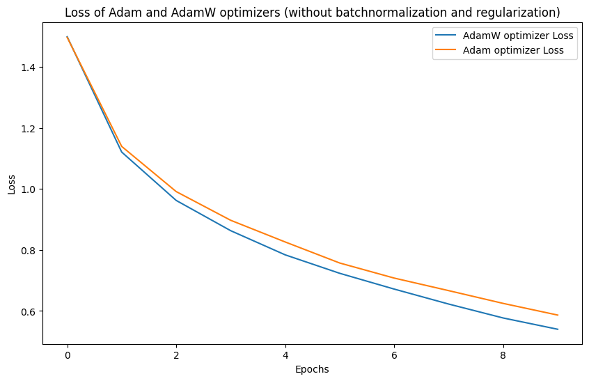
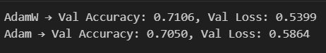

# CIFAR-10: Comparison of Adam vs AdamW Optimizer

## Objective
To compare the performance of **Adam** and **AdamW** optimizers on the CIFAR-10 image classification task.

---

## Model Details
- Dataset: CIFAR-10
- Model Architecture: 

- Input Shape: (32, 32, 3)
- Output: 10 classes

---

## Experiment Setup
- **Learning Rate**: 1e-3 for both Adam and AdamW
- **Weight Decay** (AdamW only): 1e-4
- **Batch Size**: 16
- **Epochs**: 10

---

## Key Observations

### Adam Optimizer
- Adaptive learning rate method based on first and second moment estimates.
- Weight decay incorporated as L2 penalty in the loss function.

### AdamW Optimizer
- Decouples weight decay from gradient update.
- More stable convergence and improved generalization.

---

## Results

### Validation Accuracy

### Validation Loss

---

## Conclusion
- Aadam even though had a better accuracy, AdamW had a lower loss which means it was more confident for its prediction.
- Adam, on the other hand, may overfit slightly more, achieving slightly higher accuracy, but with higher loss because the model may assign less confident probabilities.
---

