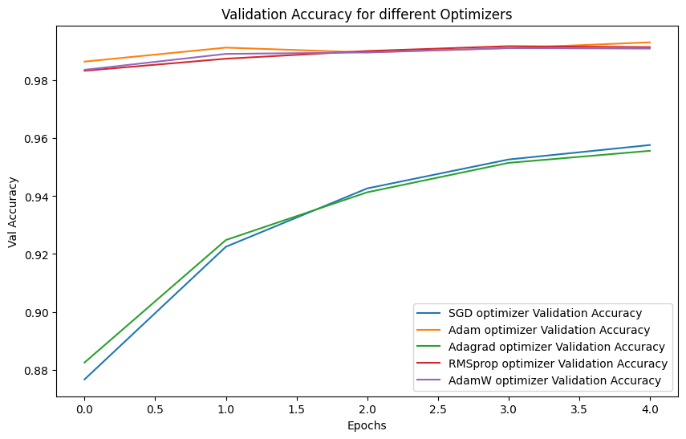
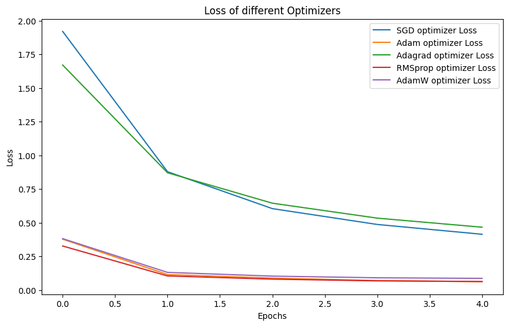
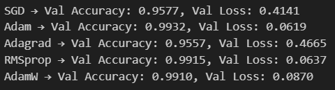

# MNIST Experiment: Comparison of Multiple Optimizers

## Objective
To evaluate and compare the performance of different optimizers on the MNIST digit classification task, while testing the effect of **Dropout**, **Batch Normalization**, and **Regularization**.

---

## Dataset
- **Dataset**: MNIST
- **Input Shape**: (28, 28, 1)
- **Output**: 10 classes (digits 0–9)

---

## Model Architecture
- Custom CNN / Fully Connected Network 
    .png>)
- Variants experimented with:
  - With Dropout
  - With Batch Normalization
  - L2 regularization on layers

---

## Experiment Setup
- **Optimizers Tested**:
  - SGD
  - RMSProp
  - Adagrad
  - Adam
  - AdamW
- **Learning Rate**: 1e-3 for all optimizers
- **Weight Decay** (AdamW only): 1e-4
- **Batch Size**: 64
- **Epochs**: 5

---

## Results

### Validation Accuracy
- Plots showing performance of each optimizer with Dropout, BatchNorm, and regularization.

### Validation Loss
- Plots showing loss curves for each optimizer.

---

## Observations
- Compare convergence speed of different optimizers.
- Evaluate impact of Dropout and Batch Normalization on training stability.
- Effectiveness of L2 regularization in reducing overfitting.

---

## Conclusion
- Optimizers like Adam and AdamW converge faster than SGD, RMSProp, and Adagrad.
- Batch Normalization and Dropout improve stability and reduce overfitting.
- Adam provides the most consistent validation performance among all optimizers tested.
